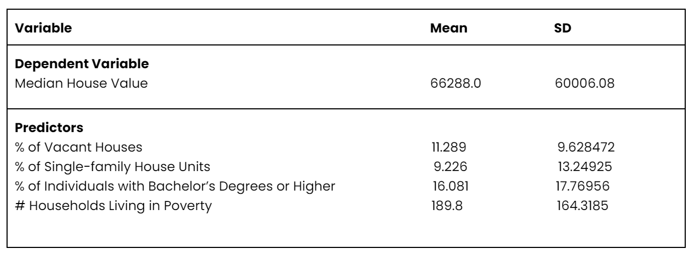
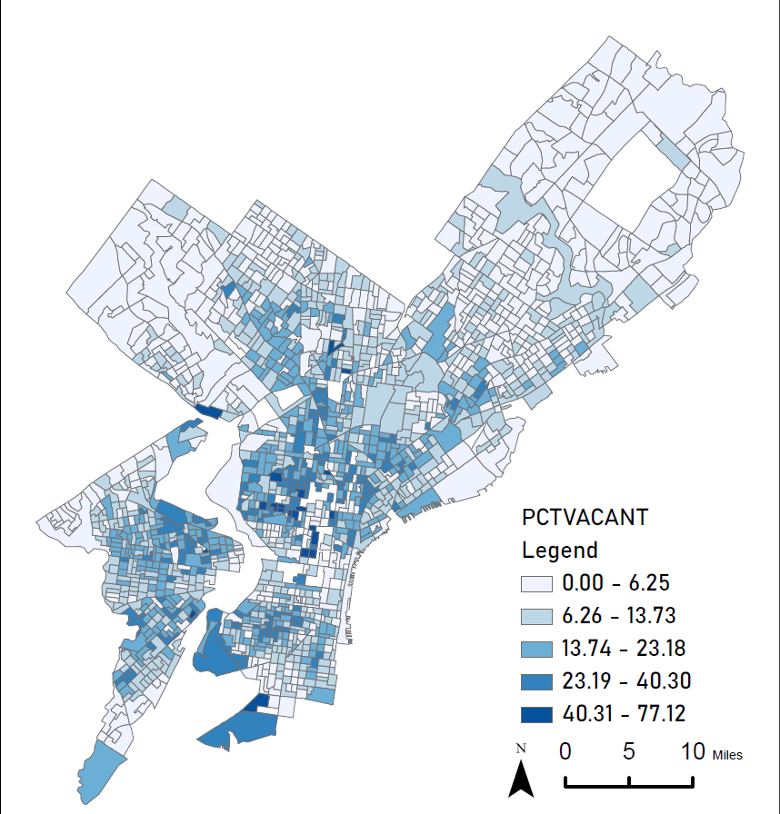
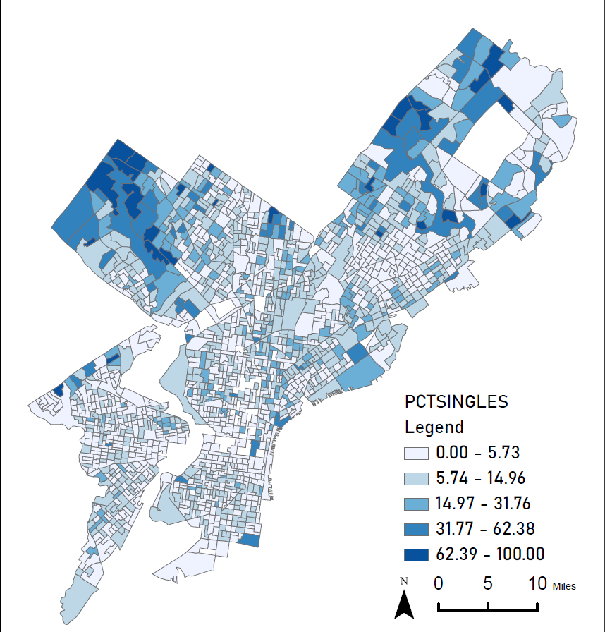
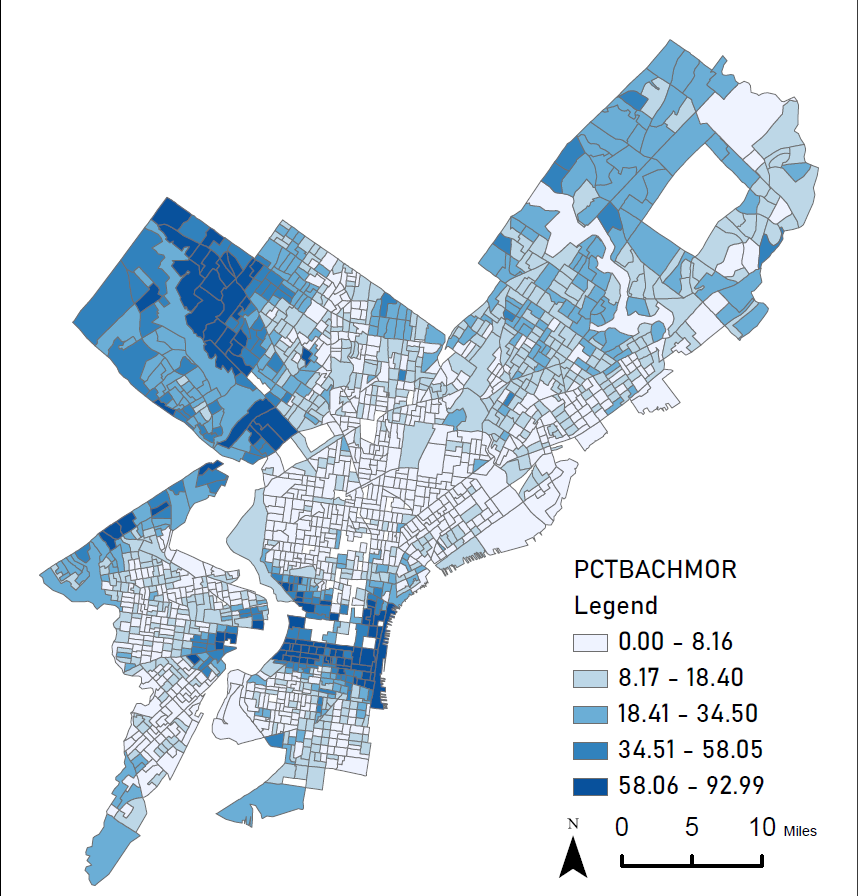
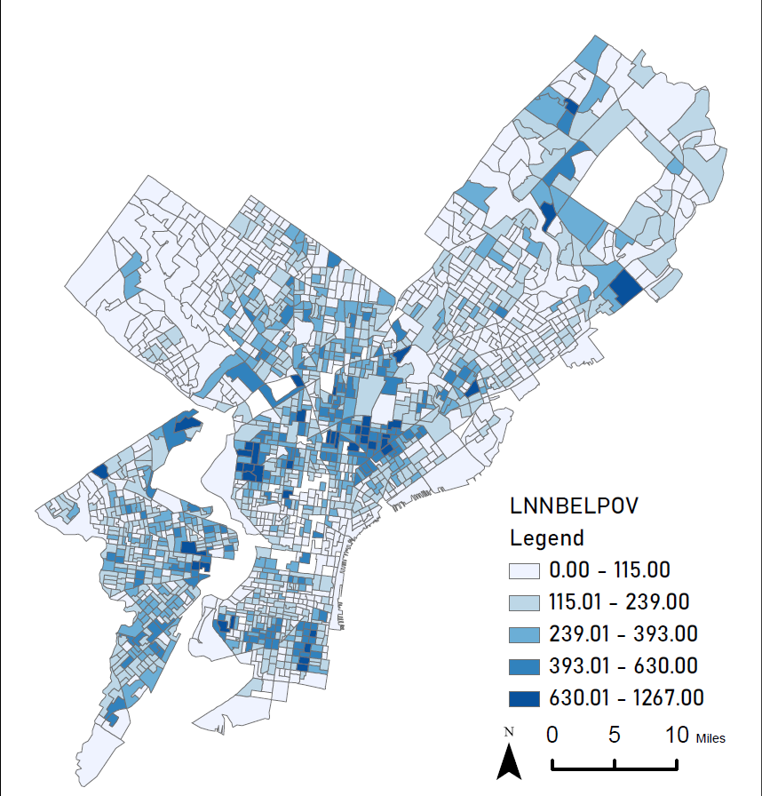
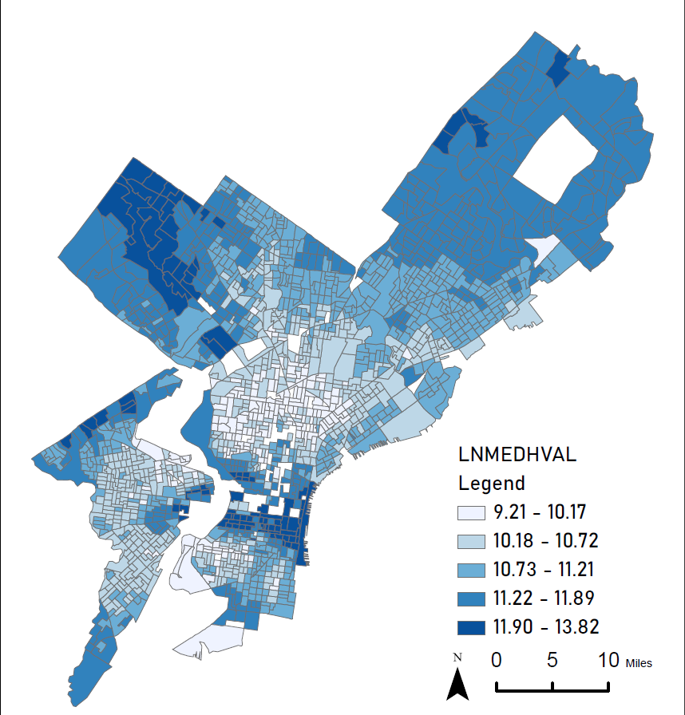
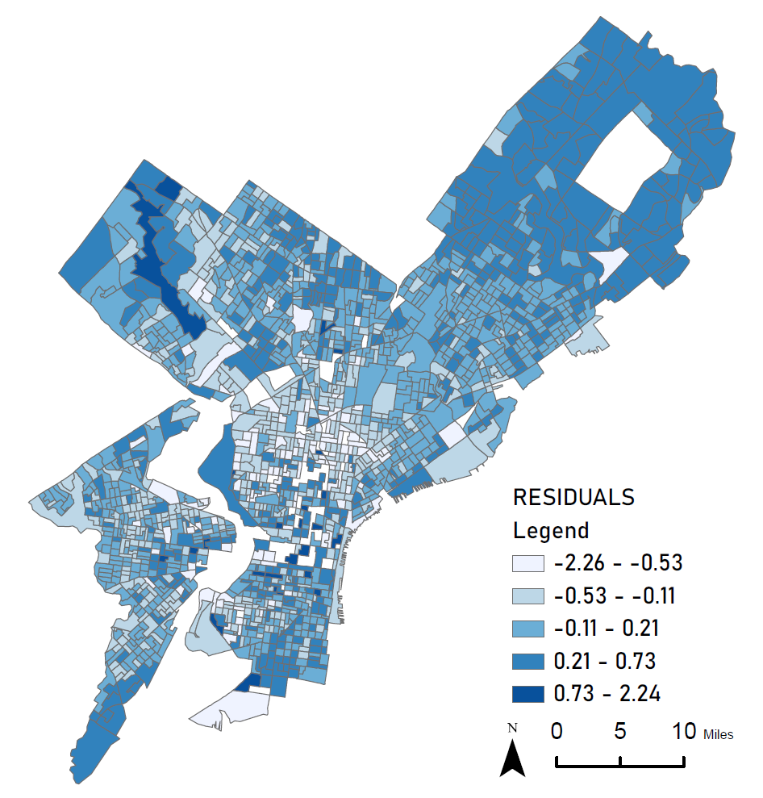

```{css, echo=FALSE}
pre {
  max-height: 300px;
  overflow-y: auto;
}

pre[class] {
  max-height: 300px;
}

```

```{r, include=FALSE}
options(width = 60)
local({
  hook_output <- knitr::knit_hooks$get('output')
  knitr::knit_hooks$set(output = function(x, options) {
    if (!is.null(options$max.height)) options$attr.output <- c(
      options$attr.output,
      sprintf('style="max-height: %s;"', options$max.height)
    )
    hook_output(x, options)
  })
})
```

```{r setup, include=FALSE}
library(knitr)
opts_chunk$set(collapse = TRUE, prompt = TRUE, echo = TRUE)
library(tidyverse)
library(DAAG)
library(MASS)
library(stargazer) 
library(ggpmisc)
library(car)
library(ggcorrplot)
rm(list=ls()) 

options(scipen = 999)

```

## Introduction

This investigation compares the median house value (MHV) of Philadelphia census tracts with several characteristics, including the percentage of individuals with bachelor’s degrees or higher, percentage of vacant houses, percentage of single house units, households living in poverty, and median household income. This relationship is explored by creating a predictive model using ordinary least squares (OLS) regression. By transforming variables, determining the correlations to detect multicollinearity and completing a k-fold cross validation to increase the accuracy of the model.

The predictor variables are all closely related to MHV. Household income and poverty levels can greatly affect projections of MHV since financial situation of household determines what house they can afford. Education level is also a valuable predictor of a positive correlation with income. The vacancy rate in the surrounding area can also affect MHV since the vacancy rate indicates the supply and demand of local housing. The relevant predictive model can be constructed by the above predictive factors.

## Methods 

### **Data Cleaning** 

Before we can predict Median House Values we have to clean the dataset. The original Philadelphia block group dataset has 1816 Observations. To clean the data we had to remove anomalies so that we can have a model that predicts more accurately. The following data was removed in order to clean our data:

- Block groups where population’s are less than 40. 
- Block groups where there are no housing units. 
- Block groups where the median house value is lower than $10,000. 
- One block group in North Philadelphia which had a very high median house value (over $800,000) and a very low median household income (less than $8,000).

After these were removed, 1720 observations remained. This made up our final dataset which we would then use to plug in our regression model. 

### **Exploratory Data Analysis**

To explore the data we will begin by examining the summary statistics and distributions of our variables. For our analysis our dependent variable is the Median Household Value (MEDHVAL) and our independent variables (which is also known as predictors) are:
- \# Households Living in Poverty (NBELPOV100)
- % of Individuals with Bachelor’s Degrees or Higher (PCBACHMORE)
- % of Vacant Houses (PCTVACANT)
- % of Single House Units (PCTSINGLES)

As part of our exploratory data analysis we will use these predictors to examine the correlation between the dependent variable (MEDHVAL). A correlation shows the relationship between variables. Thus the correlation coefficient shows the measure of correlation. We utilized the Pearson Correlation Coefficient Formula which ranges between +1 and -1. The further away the correlation coefficient is from zero, the stronger the relationship between the two variables. When the coefficient comes down to zero, then the data is considered as not related. If the value is positive there's a positive correlation, and if the value is negative, there's a negative correlation. The Pearson Correlation Coefficient Formula is as follows:

$$
r =  \frac{\sum_{i=1}^n(x_i-\overline{x})(y_i-\overline{y})}{\sqrt{\sum_{i=1}^n(x_i-\overline{x})^2}\sqrt{\sum_{i=1}^n(y_i-\overline{y})^2}}\\\
\\
r =  \frac{n\sum{xy}-(\sum{x})(\sum{y})}{\sqrt{[n\sum{x}^2-(\sum{x})^2][n\sum{y}^2-(\sum{y})^2]}}
$$


For each (X, Y) pair in our dataset, we need to find the difference between the x value and the mean x value, the difference between the y value and the mean y value, then multiply these two numbers together.  "Σ" is the Greek symbol for Sigma, and it is used in stats to signify that everything should be added up.

- $r$ = Pearson Coefficient
- $n$  = sample size
- $\sum{xy}$ = sum of products of the paired variables
- $\sum{x}$ = sum of the first variables
- $\sum{y}$ = sum of the second variables (MEDHVAL)
- $\sum{x^2}$ = sum of the squared first variables
- $\sum{y^2}$ = sum of the squared second variables (MEDHVAL)

### **Multiple Regression Analysis**
Ordinary Least Squares Regression (OLS) analysis is a statistical technique used to find the relationships between independent and dependent variables. Primarily regression analysis is used as a predictive tool for forecasting or explanatory purposes. Regression analysis measures the strength or correlation between the dependent and independent variables.

Our regression models LNMEDHVAL regressed on PCTVACANT, PCTSINGLES, PCTBACHMOR and LNNBELPOV100 using the equation below:

$LNMEDHVAL$ =$\beta_0$+ $\beta_1PCTVACANT$ + $\beta_2PCTSINGLES$ + $\beta_3PCTBEACHMOR$ + $\beta_4LNBELOWPOV100$ + $\varepsilon$

In this equation $\beta_1$ is the coefficient variables of $x_i$, (for example, $\beta_1$ PCTVACANT) and it shows the average change in dependent variable $y$ (LNMEDHVAL) associated with a 1-unit increase in the predictor $x_i$ (holding all other variables constant). $\beta_0$ is the y-intercept, which means that it is the value of the dependent variable when all predictors are 0. $\beta_1$ changes in different samples, so it is a random variable. The variable $\varepsilon$ is referred to as the residual, which is the difference between $y_i$ and $\hat{y}$. $\hat{y}$ is the predicted value of the response variable, $\beta_0$ is the y-intercept, $\beta_1$  is the regression coefficient, $\beta_2$, $\beta_3$, and $\beta_4$ are coefficients of the other predictors, and x is the value of the predictor variable.

- $y$ : The estimated value of the response variable
- $\beta_0$: The average value of the response variable when the predictor variable is zero
- $\beta_1$: The average change in the response variable associated with a one unit increase in the predictor variable
- $\varepsilon$: The residual which is the difference between the actual LNMEDHVAL and predicted MEDHVAL

Four assumptions must be met for the results of a linear regression model to be valid and reliable and they are as follows:

- Linear relationship: There exists a linear relationship between the independent variable, x, and the dependent variable, y.
- Independence: The residuals are independent. In particular, there is no correlation between consecutive residuals or any residuals. Also, observations need to be independent.
- Homoscedasticity: Randomness of Residuals: no systematic patterns.
- Normality: The residuals of the model are normally distributed.
- No multicollinearity predictor variables. This means the predictors should not be very strongly correlated.
- At least having 10 observations per predictor.

If one or more of these assumptions are violated, then the results of our linear regression may be unreliable or even misleading.

There are several parameters that need to be estimated in the regression including $\sigma_2$ and $\beta_0$ through $\beta_k$. The parameter $\sigma_2$ determines the amount of variability inherent in the regression model. When the predictor is 1, only regression lines need to be dealt with.  If $\sigma_2$ is small, then the pairs ($x_i$, $y_i$) are going to fall very close to the true line.  If $\sigma_2$ is large, then the pairs ($x_i$, $y_i$) are going to be quite spread out about the true regression line. The fitted (or predicted) values $\hat{y}_1$, $\hat{y}_2$,…, $\hat{y}_n$ are obtained by substituting $\hat{x}_1$,…, $\hat{x}_n$ into the equation of the estimated regression line, so: 

$$
\hat{y}_2 = \hat{\beta}_0 + \hat{\beta}_1x_2
$$
$$
\hat{y}_2 = \hat{\beta}_0 + \hat{\beta}_1x_n
$$

Meaning that $\hat{y}_1$*MEDHVAL* = $\beta_0$+ $\beta_1$*PCTVACANT*,  $\hat{y}_2$*MEDHVAL* = $\beta_0$+ $\beta_2$*PCTSINGLES*, etc

As mentioned above the residuals are vertical deviations from the estimated line

$$
\varepsilon_1 = y_1-\hat{y}_1\\
\varepsilon_2 = y_2-\hat{y}_2\\
\varepsilon_n = y_n-\hat{y}_n
$$


$\sigma_2$ is the variance of residuals $\varepsilon$. The estimator of $\sigma_2$ is $s_2$, and can be calculated in the equation below:

$$
\hat{\sigma}^2 = s^2 = \frac{SSE}{n-k+1}
$$

Here, 𝑘 is the number of predictors and n is the number of observations. Additionally, Least squares estimates for  ̂β0,…,  ̂βk are obtained when the quantity above for the Error Sum of Squares (SSE) is minimized. Which can be calculated in the equation below: 

$$
SSE = \displaystyle\sum_{i=1}^{n}\varepsilon^2 = \displaystyle\sum_{i=1}^{n}(y-\hat{y})^2
$$

Given n observations on y, and k predictors x1 … xk, the estimates ̂β0, ̂β1, ̂β2,…,  ̂βk are chosen simultaneously to minimize the expression for the Error Sum of Squares (SSE), given by:

$
SSE=\displaystyle\sum_{i=1}^{n}\varepsilon^2 = \displaystyle\sum_{i=1}^{n}(y-\hat{y})^2 = \displaystyle\sum_{i=1}^{n}(y_i-\hat{\beta}_0-\hat{\beta}_1x_{1i}-\hat{\beta}_2x_{2i}-\dotsc-\hat{\beta}_kx_{ki})^2
$

Coefficient of multiple determination, 𝑅2, is the proportion of observed variation in the dependent variable 𝑦 that was explained by the model. 𝑅2 can be calculated by:

$$
R^2=1-\frac{SSE}{SST}=\frac{SSR}{SST}\\\
\\
SSE=\displaystyle\sum_{i=1}^n\varepsilon^2=\displaystyle\sum_{i=1}^n(y-\hat{y})^2\\\
\\
SST=\displaystyle\sum_{i=1}^n(y-\overline{y})^2\\\
\\
SSR=SST-SSE
$$


Also, as in simple regression,

$$
SST=\sum(y_i-\overline{y}_i)^2\ {and}\ {R^2=1-\frac{SSE}{SST}}
$$


Here, R2 is the coefficient of multiple determination, or the proportion of variance in the model explained by all k predictors.

Because extra predictors will generally increase R2, it is typically adjusted for the number of predictors:

$$
R_{adj}^2=\frac{(n-1)R^2-k}{n-(k+1)}
$$

Before doing a hypothesis test for each individual predictor we do a so-called model utility test, referred to as the F-ratio, or the F-test. The F-ratio is used to test the null hypothesis (H0) that all of the regression coefficients (βi’s) are equal to zero against the alternative hypothesis (Ha) that at least one of the regression coefficients is not equal to zero. For each of the βi's, we are testing the null hypothesis (H0) that the coefficient is equal to zero against the alternative hypothesis (Ha) that the coefficient is not equal to zero.

The F-test is completed using the following formulas:
$$
H_0:\beta_1=\beta_2=\dotsc=\beta_k=0\\\
\\
H_1:\beta_1\neq0\ or\ \beta\neq0\dotsc\beta_k\neq0
$$

On the other hand, the T-test, examines the p-value associated with each independent variable 𝑥i.

$H_0:\beta_i=0$, $x_i$ is not a significant predictor of $y$.
$H_1:\beta_i\neq0$, $x_i$ is a significant predictor of $y$.


If the p-value for βi= 0 is less than 0.05, the null hypothesis is rejected, determining that 𝑥( is a significant predictor of 𝑦. When the null hypothesis cannot be rejected, the dependent variable is not related to the independent variable

### **Additional Analyses**
Stepwise regression is a statistical process in which a model is created by sequentially adding or removing predictor variables (or terms). It is an automated process that begins with an empty model, and then adds or removes terms based on the strength of the association with the response variable. Stepwise regression is used when the number of predictor variables is too large, and is a way to select the most important variables from a large set. The main advantage of stepwise regression is that it is relatively fast and efficient, and can help identify the most important variables from a large set. However, there are some drawbacks. Stepwise regression can be prone to overfitting, which can lead to inaccurate results. Additionally, it does not consider interactions between variables, so it is important to consider this when interpreting the results. Lastly, stepwise regression does not consider all possible models, so it is possible to miss important variables.

K-fold cross-validation is a type of model validation technique used in machine learning. It is a technique used to evaluate how a model performs on unseen data by splitting the original training data into k subsets of equal size. Each subset is used as a testing set in turn, while the remaining k-1 subsets are used as the training set. This process is repeated k times, each time with a different subset as the testing set. The average performance score of all k experiments is then used to estimate the performance of the model. K-fold cross-validation is used to compare the performance of different models in order to select the best model for a given dataset. It also helps identify any potential overfitting of the model to the training data. In K-fold cross-validation, the value of k is usually chosen to be 5 or 10. To operationalize the K-fold cross-validation technique, the training data is randomly split into k subsets, and k experiments are then performed in a loop. In each experiment, one of the k subsets is used as the testing set, and the remaining k-1 subsets are used as the training set. 

𝑅𝑀𝑆𝐸 stands for root mean square error, which is an estimate of the magnitude of a typical
residual. It is often used to compare different models. The model that has the smaller 𝑅𝑀𝑆𝐸 is
the better model.
$$
RMSE=\sqrt{MSE}=\sqrt{\frac{\sum_{i=1}^n(y-\hat{y})^2}{n}}
$$


To conduct this data analysis we used R program and for the maps created we used ArcGIS

## Results

### **Exploratory Results**

### Summary Statistics
The mean and standard deviation for the dependent variable (MHV) and the predictors (number of households living in poverty, percent of individuals with a bachelor’s degree or higher, percent of vacant houses, and percent of single house units for the Philadelphia Tracts) were calculated and displayed in the table below. In all cases, the variables have large standard deviations. Large standard deviations indicate that the data is spread out rather than clustered around the mean values.

```{r, loadData}
regData <- read.csv("Data/RegressionData.csv")
```

```{r, summaryStatistics}
summary(regData)
sd(regData$MEDHVAL)
sd(regData$PCTBACHMOR)
sd(regData$NBELPOV100)
sd(regData$PCTVACANT)
sd(regData$PCTSINGLES)
```



### Histogram Distribution and Logarithmic Transformation

The left side of the histogram below (Figure 1) shows the distribution of the dependent variable and predictors are positively skewed. With that in mind, a log transformation will be applied to attempt to achieve normality, as shown on the right side of the histogram. 

If the histogram is not zero-inflated (i.e., has no value at zero) and a log transform will help normalize it. The log of MHV meets this condition which can be used in the regression model.
If the histogram is zero-inflated (i.e., has value at zero) and a log-transform will not help normalize it. Therefore, none of the log of four predictors which all have value at zero can be used in the regression model. We still use the original predictors in the regression model.

The assumption that the residuals will be normal is investigated and discussed in the Regression Assumption Checks section of this report along with the other regression assumptions.

```{r, visPreTransformation, fig.width=12, fig.height=8, fig.show='hide'}
par(mfrow=c(3,2))
hist(regData$MEDHVAL)
hist(regData$PCTBACHMOR)
hist(regData$NBELPOV100)
hist(regData$PCTVACANT)
hist(regData$PCTSINGLES)

tregData <-
	regData %>%
	mutate(LNMEDHVAL = log(MEDHVAL),
				 LNPCTBACHMOR = log(1+PCTBACHMOR),
				 LNNBELPOV100 = log(1+NBELPOV100),
				 LNPCTVACANT = log(1+PCTVACANT),
				 LNPCTSINGLES = log(1+PCTSINGLES),
				 LNMEDHHINC = log(MEDHHINC)
				 )
```

*Figure 1 - Predictor Distributions and Log Transformed Predictors*

```{r, fig.width=12, fig.height=18}
par(mfrow=c(5,2))
hist(tregData$MEDHVAL,breaks = 50)
hist(tregData$LNMEDHVAL,breaks = 50)
hist(tregData$PCTBACHMOR, breaks = 50)
hist(tregData$LNPCTBACHMOR, breaks = 50)
hist(tregData$NBELPOV100, breaks = 50)
hist(tregData$LNNBELPOV100, breaks = 50)
hist(tregData$PCTVACANT, breaks = 50)
hist(tregData$LNPCTVACANT, breaks = 50)
hist(tregData$PCTSINGLES, breaks = 50)
hist(tregData$LNPCTSINGLES, breaks = 50)
```

### Choropleth maps of the variables

The Choropleth maps of predictors across Philadelphia are visualized as figure 2. While there are some similarities, the clusters in the city are not consistent on different maps. For example, both of PCTSINGLES and PCTMACHMOR maps have clusters of high percentages in Northeast Philadelphia, and low percentages in West Philadelphia. 

In both of PCTVACANT and LNNBELPOV maps, there are clusters of high percentages in North Philadelphia, University City and South Philadelphia. Given how similar these predictors are, there is a chance that they are inter-correlated and could cause multicollinearity issues.

On the other hand, PCTVACANT is close to zero for much of Northeast Philadelphia, but the cluster of high percentages in West Philadelphia. This suggests, that in some parts of the city, the percentage of vacant homes are negatively correlated with high education and single-family house. 

Combined with Figure 3, which displays the dependent variable, Log of MHV. There are highly similar clusters between the Log of MHV and PCTMACHMOR, displaying a highly positive relationship between these two variables. Also, the Log of MHV and PCTVACANT have opposite clusters, displaying a negative relationship between these two variables.

*Figure 2 - Maps of predictor Variables*






*Figure 3 - Log of MHV*



### Correlations Matrix
Figure 4 shows the Correlations Matrix. From this table, there is not severe multicollinearity among these predictors (because there are no correlations where r > 0.8 or r < 0.8) The strongest correlation exists between LNNBELPOV100 and PCTBACHMOR, which is negative at -0.32. This was not apparent by simply looking at the map. Except this, the correlation matrix corresponds with the conclusions based on the visual comparison of predictor maps. 

PCTSINGLES and PCTMACHMOR have a positive correlation of 0.2. PCTVACANT and LNNBELPOV have a positive correlation of 0.25. The correlation between PCTVACANT and PCTMACHMOR is negative at -0.3, which is also a very strong correlation. PCTVACANT and PCTSINGLES is negative at -0.15. None of these correlations are significant enough to suggest an issue with multicollinearity.
```{r, dfForRegression}
dtregdata <- tregData %>%
	dplyr::select(-MEDHVAL, -NBELPOV100, -LNPCTBACHMOR, -LNPCTVACANT, -LNPCTSINGLES)
```

```{r, correlations}
regressionVars <- dtregdata %>% 
			dplyr::select(-POLY_ID, -AREAKEY, -LNMEDHHINC, -MEDHHINC)
regressionVarsCor <- dtregdata %>% 
			dplyr::select(-POLY_ID, -AREAKEY, -LNMEDHHINC, -MEDHHINC, -LNMEDHVAL)
matrix <- cor(regressionVarsCor)
matrix
```
*Figure 4 - Correlation Matrix*

```{r}
ggcorrplot(cor(regressionVarsCor),outline.col = "white",lab =T)
```


In addition, multicollinearity is assessed by regression for each predictor k for all remaining predictors. Figure 5 shows the VIF of each predictor. No VIFS is larger than 4, so there is no multicollinearity problem.

*Figure 5 - VIFs of predictors*

```{r class.source = 'fold-show'}
predLM <- lm(LNMEDHVAL ~ PCTBACHMOR+PCTVACANT+PCTSINGLES+LNNBELPOV100, data = regressionVars)

vif(predLM)
```

### **Regression Results**

*Figure 6 - R Summary of Regression*
```{r}
predLM <- lm(LNMEDHVAL ~ PCTBACHMOR+PCTVACANT+PCTSINGLES+LNNBELPOV100, data = regressionVars)
```


```{r class.source = 'fold-show', max.height='800px'}
summary(predLM)
```

Figure 6 above shows the regression output from R sum of squares. We regressed the median house value (LNMEDHVAL) on the % of vacant houses (PCTVACANT), the % of single-family house units (PCTSINGLES), the % of individuals with a bachelor’s degree or higher (PCTBACHMOR) and the number of households living below the 100% poverty level (LNNBELPOV100). The regression output indicates that all predictor variables (PCTVACANT, PCTSINGLES, PCTBACHMOR, AND LNNBELPOV100) are highly significant. The negative coefficients of PCTVACANT and LNNBELPOV100 show they are negatively associated with LNMEDHVAL. PCTSINGLES and PCTBACHMOR are positively associated, given their positive coefficients (p<0.0001 for every variable). A one-unit increase (1%) in the % of single-family houses is associated with a 0.298% increase in median house value while holding the other predictors constant.  Similarly, A one-unit increase (i.e., percentage point) in the % of people with a bachelor's degree or higher is associated with a 2.09% increase in median house value while holding the other predictors constant. Additionally, a one-unit increase (1%) in the % of vacant houses is associated with a 1.92% decrease in median house value while holding the other predictors constant. Since NBELPOV100 was log-transformed, the coefficient indicates that the number of households with incomes below the poverty level changes by 1%, the median house value changes by (1.01 ^(-0.79)-1)*100% or -0.078%, holding all other variables constant.


The p-value of less than 0.0001 for PCTVACANT indicates that if there is no actual relationship between PCTVACANT and MEDHVAL, (if the null hypothesis that $\beta_1$=0 is actually true), then the probability of getting a $\beta_1$ coefficient estimate of -0.01916 is less than 0.0001. Similarly, the p-value of less than 0.0001 for PCTSINGLES indicates that if there is no actual relationship between PCTSINGLES and the dependent variable, MEDHVAL, (if the null hypothesis that $\beta_2$=0 is actually true), then the probability of getting a $\beta_2$ coefficient estimate of 0.00298 is less than 0.0001. Additionally, the p-value of less than 0.0001 for PCTBACHMOR indicates that if there is actually no relationship between PCTBACHMOR and the dependent variable, MEDHVAL, (i.e., if the null hypothesis that $\beta_3$=0 is actually true), then the probability of getting a $\beta_3$ coefficient estimate of 0.02091 is less than 0.0001. Finally, the p-value of less than 0.0001 for LMNBELPOV100 indicates that if there is no actual relationship between LMNBELPOV100 and MEDHVAL (if the null hypothesis that $\beta_4$=0 is actually true), then the probability of getting a $\beta_4$ coefficient estimate of -0.07891 is less than 0.0001.

These low probabilities indicate that we can safely reject $H_0:\beta_1=0$ for $H_a:\beta_1\neq0$, $H_0:\beta_2=0$ for $H_a:\beta_2\neq0$, $H_0:\beta_3=0$ for $H_a:\beta_3\neq0$,$H_0:\beta_4=0$ for $H_a:\beta_4\neq0$, (at most reasonable levels of $\alpha=P$(Type I error)).

More than 60% of the variance in the dependent variable is explained by the model (R2 and Adjusted R2 are 0.6623 and 0.6615, respectively). The low p-value (p<0.0001) associated with the F-ratio indicates that we can reject the null hypothesis that all model coefficients are 0.

### **Regression Assumption Checks** 

This section is about testing model assumptions and aptness.

Assumption 1, linear relationship between dependent variable y and every predictor $x_i$, is violated. From figure 6, a linear relationship cannot be observed, which means the assumption of linear relationship cannot be met and there will undoubtedly result in some bias in the estimate of y.When predictors are 0, MHV still has value with different predictors. This might not be realistic to see a situation when all 4 predictors are 0 in real life. Not something we should worry about though.

*Figure 7 - R Summary of Regression*

```{r, fig.width=9, fig.height=9}
par(mfrow=c(2,2))
plot(dtregdata$LNNBELPOV100, dtregdata$LNMEDHVAL)
plot(dtregdata$PCTBACHMOR, dtregdata$LNMEDHVAL)
plot(dtregdata$PCTVACANT, dtregdata$LNMEDHVAL)
plot(dtregdata$PCTSINGLES, dtregdata$LNMEDHVAL)
```

Assumption 2, residuals being normally distributed, is basically valid.  Figure 8 indicates that the Standard Residuals are close to normal distribution, meaning the assumption of normality of residuals is not violated. Normality is essential for all sample sizes to predict future values of the dependent variable (Here is the Median House Value).

*Figure 8 - Histogram of Residuals*

```{r, results='hide'}
anova(predLM)

predLM$predFit <- fitted(predLM)
predLM$predResids <- residuals(predLM)
predLM$predRStand <- rstandard(predLM)

hist(predLM$predRStand,breaks = 80)
```

Assumption 3, homoscedastic of variance of the residuals, is violated. By using standardized residuals, the residuals of the different observations can be compared to each observation. Standard Residuals are the raw residuals divided by the standard error of estimate. It can be calculated through the following formula.

$$
e_i^*\approx\frac{\varepsilon_i}{S}\approx\frac{\varepsilon_i}{\sqrt\frac{SSE}{n-2}}
$$

Figure 9 shows the relationship between standardized residual (on y-axis) and the predicted value (on x-axis). The variance of residuals seems not constant for different values of predictors (or y-hat). Clearly, this is heteroscedasticity, and a non-linear model would better describe the relationship among the variables.  The plots show that the residuals are positive for low interval, positive for high interval. And there are some outliers in the graph especially in the low and high intervals in predicted house value. Many outliers are 4-6 standard deviations away from 0, which are distributed across the range of small and large x values. In the middle interval of the predicted house value, the standardized residuals are concentrated around zero with few outliers.

*Figure 9 - Standard Residuals by Predicted Value*

```{r}
predLM <- lm(LNMEDHVAL ~ PCTBACHMOR+PCTVACANT+PCTSINGLES+LNNBELPOV100, data = regressionVars)
summary(predLM)

anova(predLM)

predLM$predFit <- fitted(predLM)
predLM$predResids <- residuals(predLM)
predLM$predRStand <- rstandard(predLM)

# Check for standardized residuals
plot(predLM$predFit, predLM$predRStand)

reg_result <- data.frame(predFit = predLM$predFit, predR_stand = predLM$predRStand)
g_reg = ggplot(reg_result, aes(x = predFit, y = predR_stand)) +
  geom_point(color="grey", size=1) +
  geom_smooth(method="lm", color="black") +
  labs(x="Predict Values", y="Standardized Residual") +
  stat_poly_eq(aes(label = paste(after_stat(eq.label),
                                 after_stat(rr.label), sep = "*\", \"*")))
```

Assumption 4, independence of observations, is violated.

Referring to Figures 2 and 3, we can draw inferences regarding the independence of the observations. Similar data tend to cluster in space, and it is simple to see spatial autocorrelation from those maps. A factor with a strong geographic relationship is median house value, for which spatial autocorrelation is inevitable. As a result, the independent observation assumption is invalid. Additionally, because they are not taken into account in multiple regression, this spatial autocorrelation may be able to explain why standardized residuals are heteroscedastic

*Figure 10 - Maps of Standardized Residuals of Regression Model*



Figure 10 above is the choropleth map of standardized regression residuals. The standardized residuals' spatial patterns can be seen. Further specific operations are required to take into account this geographical clustering since the median house values in the city center are underestimated while they are overestimated towards the north and west of Philadelphia.

### **Additional Models**

All four predictors from the original model are retained in the final model as a result of stepwise regression, making the original model the best model with the lowest AIC. The procedure's output is displayed below in Figure 11.

*Figure 11 – Stepwise Regression Results*

```{r class.source = 'fold-show', max.height='800px', collapse = TRUE}
step <- stepAIC(predLM, direction="both")
```
```{r class.source = 'fold-show', max.height='800px'}
step$anova
```

Additionally, a k-fold cross validation was completed of the original model resulting in an 𝑅𝑀𝑆𝐸 value of 0.367. whereas the RMSE of the model that only uses PCTVACANT and MEDHHINC as predictors is 0.443. Since the smaller the RMSE, the better the model, the original four-predictor model is therefore the best one.

## Discussion and Limitations

This report employed OLS regression to create a predictive model of median house values in relation to various variables. Interestingly, the percentage of singles had a p-value of 0.00002, indicating its significance, but its coefficient of 0.003 meant that an increase of 1% in percentage of singles only resulted in a 0.29% rise in median house values. This is unsurprising, as there is no clear correlation between these two variables. However, other predictors were both significant and important.

The F-ratio test indicates that the model is significant, yet R2 is only 0.6615, indicating that only 66% of the variance in the model is explained by the 4 predictors. To improve the quality of the model, it is recommended to include additional predictors, such as the type of zoning code, average built year of houses, transportation coverage rate, amenities (parks, schools, hospitals) and crime rate.

The stepwise regression model included all 4 predictors, indicating that sufficient predictors were not excluded. This suggests that all 4 predictors are likely to be significant. The $𝑅𝑀𝑆𝐸_{4-predcitor}$ of 0.367 is higher than the $𝑅𝑀𝑆𝐸_{2-predictor}$ of 0.443, demonstrating the combined effect of the percentage of singles, the percentage of bachelor, the percentage of vacant and number of poverty variables on the overall quality of the model.

$$
RMSE_{4-predictor}=0.366,RMSE_{2-predictor}= 0.443
$$

The model has several limitations. Firstly, the assumption of OLS that there is a linear relationship between the dependent variable and the predictors is not fulfilled, leading to a decrease in the model's significance and accuracy. Secondly, the homoscedasticity of the residuals’ variance is not met, resulting in systematic under or over-prediction. To address this issue, adding predictors or using spatial regression could be helpful. Thirdly, the independence of observations is broken since there are distinct clustering patterns in predictors, dependent variable, and residuals; thus, running a spatial regression like SE, SL, or GWR instead of OLS regression would be more effective.

Due to spatial nonuniformity, the predictor NBELPOV100 in the model is not an accurate representation of poverty levels as it does not take into account the clustering of population in Philadelphia. To address this issue, it would be more appropriate to use the percentage of individuals living in poverty instead.