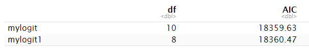

```{css, echo=FALSE}
pre {
  max-height: 300px;
  overflow-y: auto;
}

pre[class] {
  max-height: 300px;
}

```

```{r, include=FALSE}
options(width = 60)
local({
  hook_output <- knitr::knit_hooks$get('output')
  knitr::knit_hooks$set(output = function(x, options) {
    if (!is.null(options$max.height)) options$attr.output <- c(
      options$attr.output,
      sprintf('style="max-height: %s;"', options$max.height)
    )
    hook_output(x, options)
  })
})
```

## Introduction
The problem of drunk driving is a pervasive one with serious consequences. In the United States, nearly 30 people die in alcohol-related motor vehicle crashes every day, with the economic impact of these crashes estimated to be more than $59 billion annually. In Philadelphia specifically, 53,260 car crashes occurred between 2008 and 2012. This is an alarming number of incidents that must be addressed. It is important to understand which factors are correlated with alcohol-related crashes in order to better direct preventative efforts and ultimately reduce the number of such crashes. This analysis will seek to identify the predictors of accidents related to drunk driving in the City of Philadelphia.

The predictors we're using might be associated with the response variable DRINKING_D for a variety of reasons. For instance, FATAL_OR_M could be associated with DRINKING_D because the presence of a fatality or major injury in a crash could suggest that one or more drivers were driving under the influence of alcohol. OVERTURNED could be associated with DRINKING_D because an overturned vehicle could suggest that a driver was impaired and unable to control the vehicle properly. CELL_PHONE could be associated with DRINKING_D because distracted driving could lead to impaired driving. SPEEDING could be associated with DRINKING_D because driving at an excessive speed could indicate that the driver is impaired. AGGRESSIVE could be associated with DRINKING_D because aggressive driving behavior could be a sign of impairment. DRIVER1617 could be associated with DRINKING_D because drivers under the age of 18 are more likely to drink and drive than older drivers. DRIVER65PLUS could be associated with DRINKING_D because older drivers may have lower motor-neuron functioning because of age and this heightened when alcohol is consumed. This assumes that this had been a long-term behavior that caught up with the individual(s) over time. To test for these associations, we will use R to run logistic regression. The response variable will be DRINKING_D, and the predictors will be FATAL_OR_M, OVERTURNED, CELL_PHONE, SPEEDING, AGGRESSIVE, DRIVER1617, and DRIVER65PLUS. The model will estimate the probability of DRINKING_D given the values of the predictors.

## Methods
### **OLS Regression**
Ordinary least squares (OLS) regression is a statistical method used to estimate the parameters of a linear regression model by minimizing the sum of squared residuals. It is a widely used method for modeling the relationship between a dependent variable and one or more independent variables. However, this regression is not suitable for modeling a binary dependent variable. Specificially, the beta coefficient is the amount by which y changes when x goes up by 1 unit. This doesn't make much sense when y is binary. In cases where the dependent variable is binary, logistic regression is often a more appropriate method to use。

### **Logistic Regression Overview**
In cases where the dependent variable for this investigation is binary, either the driver was drinking or the driver was not drinking. Logistic regression is often a more appropriate method to use. 

Logistic regression is derived from the logit function, a statistical model used to predict the probability of an event occurring based on one or more independent variables. It is particularly useful for modeling binary dependent variables because it can estimate the probability of the dependent variable taking on a particular value (e.g., 0 or 1). Odds are the probability of an outcome occurring over another outcome. In this instance, the probability of someone crashing due to drinking and driving is:

$$
p(drinking)=\frac{\#drinking}{\#drinking+\#not\ drinking}=\frac{\#drinking}{\#crashes}
$$

Therefore, the odds of the outcome are:

$$
Odds(drinking)=\frac{\frac{\#drinking}{\#crashes}}{\frac{\#not\ drinking}{crashes}}=\frac{\#drinking}{\#not\ drinking}
$$

When the probability of an outcome approaches 1 it is more likely to happen. Conversely, when probability is close to 0 the opposite outcome is likely to happen. Odds ranges from 0 to $\infty$. The greater the odds are above 1, the outcome is more likely to occur.

Logit, or the log of odds, models binary dependent variables because it translates a linear function, like OLS for example, into a function that ranges from 0 to 1. In Figure 1, the red line is the linear model and the blue curve has been translated to reflect the binary outcome: 0 or 1.

*Figure 1_Linear and Logit Models*


The equation of both logit form and logistic form of logistic regression with multiple predictors is presented below, 
The logit form:

${ln(\frac{p}{1-p})}$=$\beta_0$+$\beta_1*\scriptsize{FALATAL\_OR\_M}$+$\beta_2*\scriptsize{OVERTURNED}$+$\beta_3*\scriptsize{CELLPHONE}$+$\beta_4*\scriptsize{SPEEDING}$+$\beta_5*\scriptsize{AGGRESSIVE}$+$\beta_6*\scriptsize{DRIVER1617}$+$\beta_7*\scriptsize{DRIVER65PLUS}$+$\beta_8*\scriptsize{PCTBACHMOR}$+$\beta_9*\scriptsize{MEDHHINC}$+$\varepsilon$

The logistic form:

$p$ = $P(\tiny{DRINKING\_D=1})$ =$\frac{e^{\beta_0+\beta_1*\tiny{FALATAL\_OR\_M}+\beta_2*\tiny{OVERTURNED}+\beta_3*\tiny{CELLPHONE}+\beta_4*\tiny{SPEEDING}+\beta_5*\tiny{AGGRESSIVE}+\beta_6*\tiny{DRIVER1617}+\beta_7*\tiny{DRIVER65PLUS}+\beta_8*\tiny{PCTBACHMOR}+\beta_9*\tiny{MEDHHINC}+\varepsilon}}{1+e^{\beta_0+\beta_1*\tiny{FALATAL\_OR\_M}+\beta_2*\tiny{OVERTURNED}+\beta_3*\tiny{CELLPHONE}+\beta_4*\tiny{SPEEDING}+\beta_5*\tiny{AGGRESSIVE}+\beta_6*\tiny{DRIVER1617}+\beta_7*\tiny{DRIVER65PLUS}+\beta_8*\tiny{PCTBACHMOR}+\beta_9*\tiny{MEDHHINC}+\varepsilon}}$

Here, $\beta_0$ is the constant, and $\beta_n$ ($n$ = 1,2, … ) is the coefficient of each predictor. $p$ = $P(DRINKING\_D=1)$ is the probability of drunk driving, and $ln(\frac{p}{1-p})$ is the log odds which has been interpreted above as the natural log of the ratio of drunk driving and not drunk driving. When $ln(\frac{p}{1-p})$ gets really big, the probability of drunk driving approaches 1. While $ln(\frac{p}{1-p})$ gets really small, the probability of drunk driving approaches 0

## **Logistic Regression Hypothesis Testing**
For each predictor a hypothesis test is completed to determine if its coefficient i is 0:

$$
H_0:\beta_i = 0(OR_i=1)\\
\\
H_a:\beta_i\neq0(OR_i\neq1)
$$

The quantity below is the difference between the observed ($\hat\beta_i$) and estimated E($\hat\beta_i$) values of the coefficient for the predictor, divided by the standard deviation, which has a standard normal distribution:

$$\frac{\hat\beta_i-E(\hat\beta_i)}{\sigma_{\hat\beta_i}}$$

According to the $H_0$, $E(\hat\beta_i)=0$, and the remaining quantity is referred to as $z$, or the Wald Statistic:

$$z=\frac{\hat\beta_i}{\sigma_{\hat\beta_i}}$$

In order to reject the null hypothesis that the predictors have a non-zero coefficient, the z-value must be significant. Instead of comparing estimated coefficients, many statisticians prefer to examine odds ratios. Odds ratios are another way to measure the strength of the relationship between a predictor and the response variable. Instead of comparing the estimated coefficients directly, odds ratios are determined by exponentiating the coefficients. This can be helpful because odds ratios are often easier to interpret than coefficients, especially for non-technical audiences.

## **Logistic Regression Assessment**

OLS regression is assessed using $R^2$ values, which indicates what percent of variation is explained by the model. This value can be calculated for logistic regression; In logistic regression, R-squared is a measure of goodness of fit that indicates the proportion of variance in the dependent variable that is predictable from the independent variables. However, it is not a very useful metric for evaluating the fit of the model. This is because the logistic function is not linear. In addition, the interpretation of R-squared in logistic regression is not straightforward, making it a less reliable metric for evaluating the fit of the model.

The Akaike Information Criterion (AIC) is a measure of the relative quality of a statistical model. It is calculated based on the likelihood function of the model and the number of parameters in the model. The AIC is used to compare different models and determine which model is the best fit for the data. A lower AIC value indicates a better fit of the model to the data. When comparing multiple models, the model with the lowest AIC is considered the best fit.

Sensitivity, specificity, and the misclassification rate are also used in the assessment of models. Sensitivity, also known as the true positive rate, measures the proportion of actual positive instances that are correctly identified by the model. Specificity, or the true negative rate, measures the proportion of actual negative instances that are correctly identified. The misclassification rate represents the proportion of instances that are incorrectly classified, including false negatives and false positives. Sensitivity is calculated as the ratio of true positives to all actual positives, specificity is calculated as the ratio of true negatives to all actual negatives, and the misclassification rate is calculated as the ratio of false negatives plus false positives to the total number of samples. Higher values of sensitivity and specificity indicate a better fit for the model, while a higher misclassification rate is undesirable.

The results of logistic regression, or the fitted/predicted values, $\hat{y}$, are probabilities between 0 and 1. The greater the value, or the closer the $\hat{y}$, is to 1, the more likely that outcome is to occur. A $\hat{y}$, of 0.1 suggests the outcome only has a 10% chance of occurring. On the other hand, a $y$, value of 0.9 suggest the outcome has a 90% chance of occurring and just a 10% chance of not occurring.

In this investigation, The predicted value of $y(\hat{y})$ represents the probability that there being an alcoholimpaired driver in a vehicle crash, and it is calculated by the logistic model equation.Before interpreting the value, we need to select a cut-off value. If $y$ > the cut-off value, we consider this to be a relatively high probability of drunk driving, and if $y$ < the cut-off value, we consider this to be a relatively low probability of drunk driving. The choice of cut-off can significantly affect the values of measures such as sensitivity, specificity, and the misclassification rate which means Sensitivity, specificity, and the misclassification rate also change as the cut-off value change. To find the optimal values for these measures, it is necessary to try different cut-off values and evaluate the resulting performance of the model.

The receiver operating characteristic (ROC) curve is a graphical representation of the true positive rate against the false positive rate of a classification model. It can be used to evaluate the predictive quality of the model and identify an optimal cut-off value for classifying instances as positive or negative. There are several methods for selecting an optimal cut-off using an ROC curve, including:

- The Youden Index method, which selects the cut-off at which the sum of sensitivity and specificity is maximized.
- The minimum distance method, which selects the cut-off at which the ROC curve is closest to the upper left corner of the graph (where both sensitivity and specificity equal 1).

In this report, we will use the minimum distance method to identify an optimal cut-off value for the classification model. This method involves finding the cut-off that minimizes the distance between the ROC curve and the upper left corner of the graph, resulting in the highest possible values for both sensitivity and specificity.

Another way to measure the prediction accuracy of a classification model is by calculating the area under the receiver operating characteristic (ROC) curve (AUC). The AUC represents the probability that the model will correctly classify a randomly chosen positive instance as higher than a randomly chosen negative instance. A higher AUC indicates that the model is able to find a cut-off value with both relatively high sensitivity and specificity. The value of the AUC ranges from 0.5 to 1, with the following interpretations:

- 0.9 to 1: Excellent model
- 0.8 to 0.9: Good model
- 0.7 to 0.8: Fair model
- 0.6 to 0.7: Poor model
- 0.5 to 0.6: Failure in model prediction

If the AUC is 0.5, it means that the model's performance is no better than a random guessing. In this case, the model is not able to differentiate between positive and negative instances, and the values of sensitivity and specificity will be close to 0.5 regardless of the cut-off value selected.

In this investigation, the optimal cut-off will be selected by reducing the misclassification rates and examining the ROC curve with the smallest distance between the upper left corner and the curve, or the greatest AUC.

## **Assumptions of Logistic Regression**

Logistic regression is a type of statistical model that is used to predict a binary outcome (such as success or failure, yes or no, etc.). Like ordinary least squares (OLS) regression, logistic regression relies on the assumption of independence of observations and the absence of multicollinearity between the predictors. However, there are several key differences between logistic regression and OLS regression:

- The dependent variable in logistic regression must be binary, while in OLS regression it can be continuous.
- There is no assumption of a linear relationship between the dependent variable and predictors in logistic regression, while in OLS regression there is an assumption of a linear relationship.
- There is no assumption of homoscedasticity in logistic regression, while in OLS regression the assumption of homoscedasticity is required.
- The residuals in logistic regression do not need to be normally distributed, while in OLS regression the residuals must be normally distributed.
- Logistic regression requires at least 50 observations for each predictor, while OLS regression only requires 10 observations.

It is important to consider these differences when deciding which type of regression model to use for a particular analysis.

## **Exploratory analyses before logistic regression**

Before running a logistic regression analysis, we will conduct an exploratory analysis of the data to examine the associations between the dependent variable (DRINKING_D) and several binary predictor variables (FATAL_OR_M, OVERTURNED, CELL_PHONE, SPEEDING, AGGRESSIVE, DRIVER1617, and DRIVER65PLUS). To do this, we will create cross-tabulations that show the number and percentage of 1 responses (i.e., death or major injury) for each predictor variable by category of the DRINKING_D variable. We will also record the total number of 1 responses in the data set. To see the proportions and numbers for each predictor when the driver is not drunk, when the driver is drunk, and in total, we will use R to repeat this process. This will provide insights into the relationships between the variables and inform our decision to run a logistic regression model.

One method for examining the association between two categorical variables is the Chi-square test. This test is based on the Chi-square distribution of the test statistic under the null hypothesis.

*As an example, consider the first predictor variable (FATAL_OR_M). The null hypothesis in this case is that the proportion of fatalities in crashes involving drunk drivers is the same as the proportion of fatalities in crashes not involving drunk drivers. The alternative hypothesis is that the proportion of fatalities in crashes involving drunk drivers is different from the proportion of fatalities in crashes not involving drunk drivers. We can reject the null hypothesis in favor of the alternative and conclude that there is an association between drunk driving and crash fatalities if the Chi-square statistic has a high value and a p-value lower than 0.05.*

We will apply the Chi-square test to the remaining predictor variables in a similar manner to assess their relationship with the dependent variable.

As part of our exploratory analysis, we will use independent samples t-tests to assess whether there are significant differences in the group means and standard deviations of two continuous predictor variables (PCTBACHMOR and MEDHHINC) for crashes involving drunk drivers and those not involving drunk drivers.

For the variable PCTBACHMOR, the null hypothesis is that the average values are the same for crashes involving drunk drivers and those not involving drunk drivers, while the alternative hypothesis is that the average values are different for the two groups. Similarly, for the variable MEDHHINC, the null hypothesis is that the average values are the same for the two groups, while the alternative hypothesis is that the average values are different. We will use R to conduct these tests and evaluate the t-statistic and p-value to determine whether we can reject the null hypothesis in favor of the alternative. If the t-statistic is high and the p-value is lower than 0.05, this suggests that there is a significant difference between the group means.

## Result
### **Results of the exploratory analyses**
According to the data presented in Table 1, out of all car crashes in the dataset, those involving drunk driving accounted for 5.73% (2485 crashes). This is a relatively small proportion compared to the 94.27% of car crashes that were not associated with alcohol.

*Table 1 _ Tabulation of DRINKING_D*


The cross-tabulation table in the data shows that out of the total number of accidents involving drunk driving (188 accidents), 7.6% resulted in a fatality or major injury. In contrast, among accidents that did not involve drunk driving (1181 accidents), only 2.90% resulted in a fatality or major injury.

The results of the Chi-Square test for the predictors (excluding CELL_PHONE) show that the p-values are very small (p < 0.05), indicating a significant association between drunk driving and these predictors. Therefore, we can reject the null hypothesis $(H_0)$ in favor of the alternative and conclude that there is an association between drunk driving and these predictors. However, the p-value for CELL_PHONE is 0.69, indicating a weaker association between drunk driving and drivers using cell phones. As a result, we fail to reject the null hypothesis for this predictor.

*Table 2 _ Cross-tabulation table with binary predictors*


After examining the association between the dependent variable (DRINKING_D) and the two continuous predictors (PCTBACHMOR and MEDHHINC) using a t-test, we found that the mean value of the percentage of drunk drivers with at least a bachelor's degree was 16.61%, with a p-value of 0.914. The mean value of the median household income for drinking drivers was $31998, with a p-value of 0.16. None of these p-values were less than 0.05, indicating that we cannot reject the null hypothesis that the average values of PCTBACHMOR and MEDHHINC are the same for crashes involving drunk drivers and those that do not. This suggests that there is not a significant association between these continuous predictors and the dependent variable.

*Table 3 _ Cross-tabulation table with continuous predictors*


## **Comments on logistic regression assumptions**

The first assumption of logistic regression is that the dependent variable must be binary, which is the case in our study, where the dependent variable is whether the driver was drunk (1 for alcohol involvement and 0 for no alcohol involvement). We also meet the assumption of having a larger sample size than required for linear regression, with more than 50 observations for each predictor. Additionally, we need to ensure that there is not severe multicollinearity among the predictors, which occurs when two or more predictors are very strongly correlated with each other. The matrix of the pairwise Pearson correlations shows that there is no correlation with a value greater than 0.8 or less than -0.8, indicating that there is no severe multicollinearity. It is worth noting that Pearson correlations can only measure linear relationships between continuous variables and may not be suitable for evaluating the relationship between categorical variables. In this case, we should use the Chi-Square test to assess the association between the binary predictors. However, in the context of regression, when evaluating multicollinearity, it is generally acceptable to use Pearson correlations.

*Table 4_ Correlation matrix of variables*


## **Logistic regression results**
*Figure 2_Results of logistic regression*


Figure 2 displays the results of the logistic regression. The intercept and six predictors including FATAL_OR_M, OVERTURNED, SPEEDING, AGGRESSIVE, DRIVER1617, DRIVER65PLUS, and MEDHHINC with very low p values are statistically significant, while the other two predictors including CELL_PHONE, and PCTBACHMOR are not statistically significant.

*Table 5_Odds ratios for predictors*


According to the logistic regression results, holding all other predictors constant:

- The odds of a crash resulting in a fatality or major injury caused by a drunk driver are approximately (2.257 - 1)*100% = 125.7% higher the odds of a crash not resulting in fatality or major injury caused by a drunk driver.
- The odds of there being a drunk drive are approximately (2.531 -1)*100% = 153.1% higher when when there is an overturned vehicles than when there is no overturned vehicles.
- The odds of there being a drunk drive are approximately (4.660 - 1) * 100% = 366.0% higher when the car was speeding than the car was not speeding.
- The odds of there being a drunk drive are approximately (0.551 - 1) * 100% = 44.9% lower when the driver was engaging in aggressive driving than the driver was not engaging in aggressive driving..
- The odds of there being a drunk drive are approximately (0.278-1) * 100% = 72.2% lower when the driver is aged 16-17 than the driver is not aged 16-17.
- The odds of there being a drunk driver are approximately (0.461-1)*100% = 53.9% lower when the driver is 65 or older the the driver is not older than 65.
- A 1 unit increase in median household income (MEDHHINC) is associated with a very slight increase in the odds of a crash involving a drunk driver, compared to a crash not involving a drunk driver.

*Table 6_Specificity, sensitivity, and misclassification rates for different cut-offs*


It appears that among the ten cut-off values that were used to calculate the misclassification rate, the cut-off value of 0.5 resulted in the smallest misclassification rate of 0.057. However, the sensitivity at this cut-off value was only 0.002. The ROC curve shows that the optimal cut-off rate, as determined by minimizing the distance from the upper left corner of the graph, is 0.0637.

*Table 7_Specificity, sensitivity, and misclassification rates for optimal cut-off rate*


This is significantly different from the optimal rate of 0.5 obtained from table 6. When the cut-off rate is 0.5, the misclassification rate is minimized, but when the cut-off rate 
is 0.0637, the sensitivity and specificity are maximized at 0.6608 and 0.5452, respectively.

*Figure 3_The ROC curve*


The area under the ROC curve (AUC) is 0.6399, which indicates if you have 2 randomly selected observations, such that the first has a drunk driver and the second doesn't, then 64% of the time, the y-hat for the 1st will be higher than the y-hat for the 2nd observation. This is considered to be poor performance for a classifier model. This value indicates that the prediction accuracy of the logistic model is poor.

Then, we run a logistic regression with only binary predictors on DRIVING_D. Below are the results of this regression.

*Figure 4_Results of logistic regression on only binary variables*


Figure 4 displays the results of the logistic regression. One of the predictors, CELL_PHONE, was not statistically significant in the model, as indicated by a p-value of 0.875. This means that the presence or absence of CELL_PHONE did not have a significant effect on the outcome. While the other six binary predictors and the intercept were significant in the model.

*Table 8_AIC of mylogit and mylogit 1 model*


The Akaike Information Criterion (AIC) for both models is shown in table 8. The  AIC of the  logistic regression with only binary predictors on DRIVING_D is 18360.47, which suggests that it is just a little bit larger than the other model. The AIC is a measure of the relative quality of a statistical model, and it is used to compare the performance of different models. A lower AIC value indicates a better-performing model. But a difference in AIC of less than 3 is negligible. In this case, We would choose the simpler model (without continuous predictors).

## Discussion
This report aims to identify predictors of accidents related to drunk driving.  We first used a Chi-Square test to see if the distribution of the dependent variable varies with the value of the seven binary variables. Then used a t-test to examine the association between the dependent variable and the other two continuous variables. Next, we conducted a logistic regression analysis of the dependent variable on all nine predictor variables. The results showed that the strong predictors of crashes involving drunk driving are FATAL_OR_M, OVERTURNED, SPEEDING, AGGRESSIVE, DRIVER1617, DRIVER65PLUS, and MEDHHINC. The other two predictor variables, CELL_PHONE and PCTBACHMOR, were not found to be associated with the dependent variable. 

Then we conducted a logistic regression analysis using only the seven binary predictor variables, but the Akaike Information Criterion (AIC) for the model with nine predictor variables was slightly lower. The variable FATAL_OR_M was found to be significant and its relationship with the dependent variable was in the expected direction.

Overall, we think that logistic regression is an appropriate statistical technique for this analysis. The sample size is large, with 94.3% of the samples representing crashes related to drunk driving and 5.7% representing crashes not related to drunk driving. However, we did not examine whether the observations in the sample are independent of each other because they did not have location data for the vehicle crashes. This lack of independence may have contributed to the low accuracy of the logistic model.

When we attempted to minimize the misclassification rate, they found that the sensitivity value was close to 0 while the specificity value was close to 1. This indicates that the model has a strong ability to correctly predict crashes that do not involve a drunk driver but is unable to accurately predict crashes that do involve a drunk driver. That's because 94% of the observations don't involve a drunk driver. If we say that everyone is not a drunk driver, we will be wrong only 6% of the time, but such a model is not useful. When the researchers maximized the sensitivity and specificity using a receiver operating characteristic (ROC) curve, they found that the area under the curve (AUC) was smaller than 0.7, indicating poor prediction accuracy.
In summary, we need to improve the model in future research to increase the accuracy and sensitivity of prediction.